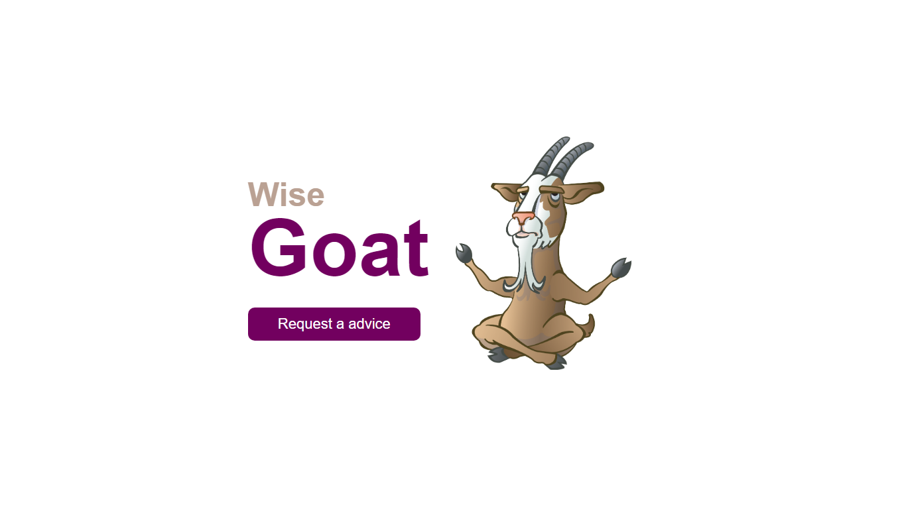
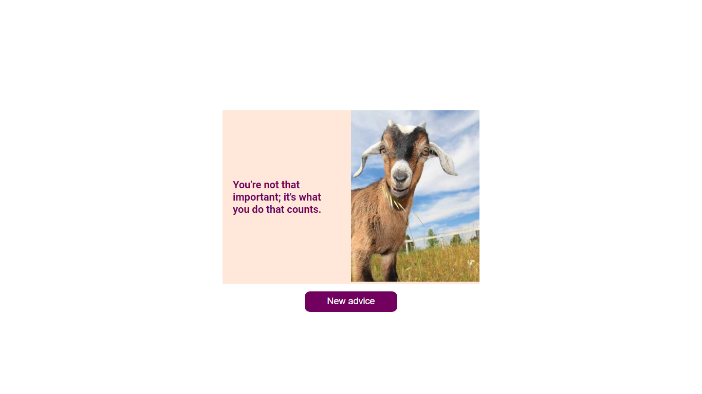

<br />
<p align="center">
 
   
   

  <h1 align="center">Wisegoat</h1>

</p>

## Descrição
Este foi o <a href="https://github.com/devchallenge-io/wisegoat">desafio</a> sugerido para consumir duas APIs terceiras, uma para gerar os conselhos e outra para gerar as imagens, ambas de forma aleatória.
___

## Demo
Acesse a <a href="https://gustavodias7.github.io/wisegoat/">demonstração</a> do site.
___

## Techs
- HTML
- CSS
- JavaScript
___

## Download
```bash
$ git clone https://github.com/GustavoDias7/wisegoat.git
$ cd wisegoat
$ start index.html
```
___

## Meus Contatos
- <a href="https://www.linkedin.com/in/gustavo-dias-3100211b6/">Linkedin</a>
- <a href="https://www.instagram.com/gugadias__/">Instagram</a>
___

## Devchallenge 
<a href="https://devchallenge.now.sh/">DevChallenge</a> permite que você evolua suas skills como programador!